# 反向传播算法

## 一、公式推导

### 1.1 正向传播

1. 计算隐藏层神经元h的输入加权和：
   $$
   h_I=w_I\cdot x+b_I=
   \begin{bmatrix}
   w_1\\w_2
   \end{bmatrix}x_1+
   \begin{bmatrix}
   w_3\\w_4
   \end{bmatrix}x_2+
   \begin{bmatrix}
   b_1\\b_2
   \end{bmatrix}
   $$

2. 通过Sigmoid函数计算神经元h的输出：
   $$
   h_{O}=\frac{1}{1+e^{-h_{I}}}
   $$

3. 计算输出层神经元的输入：
   $$
   u=w_O\cdot h_O+b_O=w_1^{\prime}h_1+w_2^{\prime}h_2+b^\prime
   $$

4. 通过Sigmoid函数计算神经元u的输出：
   $$
   \hat{y}=\frac{1}{1+e^{-u}}
   $$

5. 使用损失函数计算真实值与预测值的偏差：
   $$
   E=\frac{1}{m}\sum_{i=1}^m(y_i-\hat{y}_i)^2
   $$
   

### 1.2 反向传播

1. 隐藏层到输出层的权重和偏置更新（以$w^\prime_1$为例）

   - 计算权重的偏导数
     $$
     \frac{\partial{E}}{\partial{w^\prime_1}}=\frac{\partial{E}}{\partial{\hat{y}}}\cdot\frac{\partial{\hat{y}}}{\partial{u}}\cdot\frac{\partial{u}}{\partial{w^\prime_1}}\\
     \frac{\partial{E}}{\partial{\hat{y}}}=\frac{\partial(y-\hat{y})^2}{\partial{\hat{y}}}=-2(y-\hat{y})\hat{y}\\
     \frac{\partial{\hat{y}}}{\partial{u}}=\hat{y}(1-\hat{y})\\
     \frac{\partial{u}}{\partial{w^\prime_1}}=h_1
     $$
     
   
   - 更新权重
     $$
     w^{\prime+}_1=w^{\prime}_1-\eta\frac{\partial{E}}{\partial{w^\prime_1}}
     $$
     

## 二、案例

现有训练集数据如下：

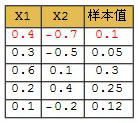

1. 初始化参数：

   输入：$x_1=0.4,x_2=-0.7$​

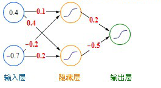

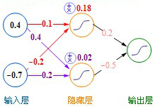

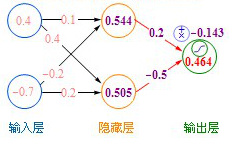

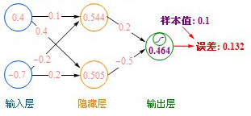

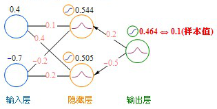

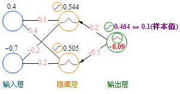

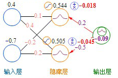

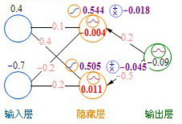

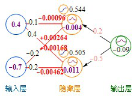

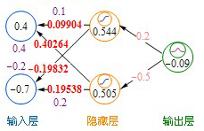

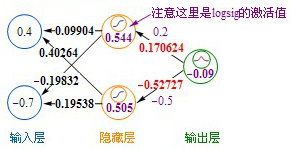
